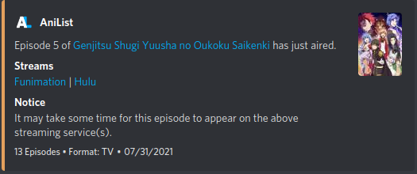

# AniSchedule [](https://github.com/TehNut/AniSchedule/releases/latest)

A Discord bot that uses the [AniList](https://anilist.co) API to retrieve the airing schedule for configured anime and
sends a message when a new episode has aired.

Invite the instance managed by myself by [clicking here](https://discord.com/api/oauth2/authorize?client_id=872994081498882118&permissions=51539610624&scope=bot%20applications.commands).



## Commands

Commands are now handled directly through Discord's slash command system. This includes permissions, as well! 

When the bot is first added to a server, only `/about`, `/upcoming`, and `/watching` will be available to users. The server owner will need to run `/permission <PERMISSION>` to enable other commands for anybody else. Editing commands can be limited to either just the owner, a specific role, or the limit can be removed and anybody can use them. 

In order to reduce potential spam, commands that take a channel argument will send an ephemeral reply if the channel requested is not the same as the one the command was used in.

## Running Yourself

Make sure you have [Node.js](https://nodejs.org/) installed.

Run these commands to get the project locally:

```sh
git clone https://github.com/TehNut/AniSchedule.git # or clone your own fork
cd AniSchedule
npm install
npm run build
```

Create a new `.env` file in the root directory of the project (the same directory as this README) with the following properties:

| Variable Name  | Type | Required | Description |
|----------------| ---- | -------- | ----------- |
| $TOKEN | `String` | Yes | The token for your bot which you can get from [Discord's developer panel](https://discordapp.com/developers/) |
| $SET_ACTIVITY | `boolean` | No | Sets bot activity to the number of unique shows it is handling announcements for across all servers |
| $MODE | `DEV` or `any` | No | If set to `DEV`, commands will be registered to a guild instead of globally. Guild-registered commands are updated instantly, while globally registered commands take up to an hour to sync. Any other value will register commands globally as normal. |
| $DEV_SERVER_ID | `number` | No | The server ID to register commands to when `MODE` is set to `DEV`. |
| $STREAM_SITE_ICONS | `String` | No | A comma separated list of emoji IDs. See [here](#stream-site-icons) for more. |

Finally, run `npm run dev` to start the bot.

### Docker

Create the `.env` file as you would above and run `docker-compose up`. 

### Stream Site Icons

This allows for icons to be displayed next to the site name in the notification embed. 

An example entry in the list would be `<:amazon:875166861958991912>`. To get this value, send a message with the emoji you want to use, but put a `\` in front of it. The sent message will display the string necessary. The order in which these should be listed is as follows:

1. Amazon
2. AnimeLab
3. Crunchyroll
4. Funimation
5. HiDive
6. Hulu
7. Netflix
8. VRV