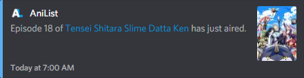
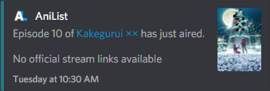

# AniSchedule [](https://github.com/TehNut/AniSchedule/releases/latest)

A Discord bot that uses the [AniList](https://anilist.co) API to retrieve the airing schedule for configured anime and
sends a message when a new episode has aired.

 

## Running Locally

Make sure you have [Node.js](https://nodejs.org/) installed.

Run these commands to get the project locally:

```sh
git clone https://github.com/TehNut/AniSchedule.git # or clone your own fork
cd AniSchedule
npm install
npm build
```

Create a new `.env` file in the root directory of the project (the same directory as this README) with the following properties:

```
BOT_TOKEN=$TOKEN
COMMAND_PREFIX=$PREFIX
PERMISSION_TYPE=$PERMISSION
```

`$TOKEN` should be the bot token obtained from [Discord's developer panel](https://discordapp.com/developers/).

`$PREFIX` should be a string required before the command name. If unset, `!` will be used.

`$PERMISSION` defines which users can add/remove watches. It should be one of the following:

  * `ANY`

    Anybody can modify

  * `CHANNEL_MANAGER`

    Users with the "Manage Channel" permission will be able to modify

  * `SERVER_OWNER`

    Only the server owner can modify

Finally, run `npm start` to start the bot.

## Commands

Commands should be prefixed by the prefix set in the `.env` file.

eg: If your prefix is `?as`, the command would be `?aswatch`.

* `watch`

  This command adds a new anime to watch for new episodes of. The AniList ID, AniList URL, or MyAnimeList URL can be used
  to add new series. You can also list several in a row to add multiple at the same time. Whatever channel this is used
  in is the channel the announcements will be made in. This follows the permission level set in the `.env` file.

  A 👍 reaction indicates that adding this anime was successful. A 👎 reaction indicates that it was unsuccessful. An unsuccessful
  reaction could mean that the channel is already watching that anime or that the ID was invalid.

  eg: In the URL `https://anilist.co/anime/99263/Tate-no-Yuusha-no-Nariagari/`, the ID is `99263`.

* `unwatch`

  This command removes an anime from the list. Just as with the `watch` command, it takes the AniList media entry link or
  the media ID. Must be used in the channel that the watch was added to. This follows the permission level set in the `.env`
  file.

  A 👍 reaction indicates that removing this anime was successful. A 👎 reaction indicates that it was unsuccessful. An unsuccessful
  reaction could mean that the channel was not watching that anime or that the ID was invalid.

* `next`

  This command will display the next anime to air (in the next 7 days) that the current channel is watching.

  A 👎 reaction indicates that it was unsuccessful. An unsuccessful reaction could mean that the channel is not watching
  any anime or that none of the watched anime have an episode airing in the next 7 days.

* `watching`

  This command prints a list of all anime names being watched that are still currently airing. It can be used by anybody.

  A 👎 reaction indicates that it was unsuccessful. An unsuccessful reaction means that this channel is not watching any
  anime.

* `help`

  This command lists all available commands along with a short description.
